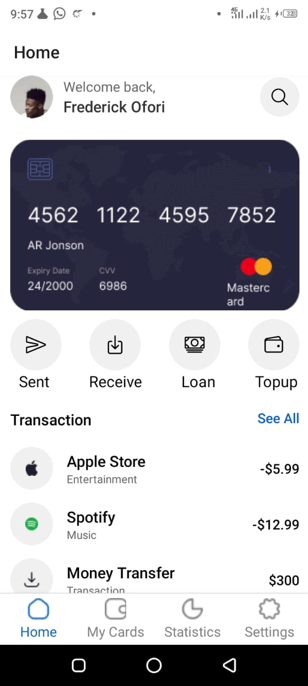
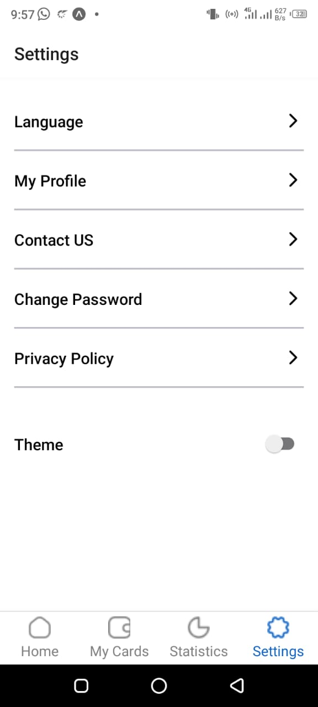
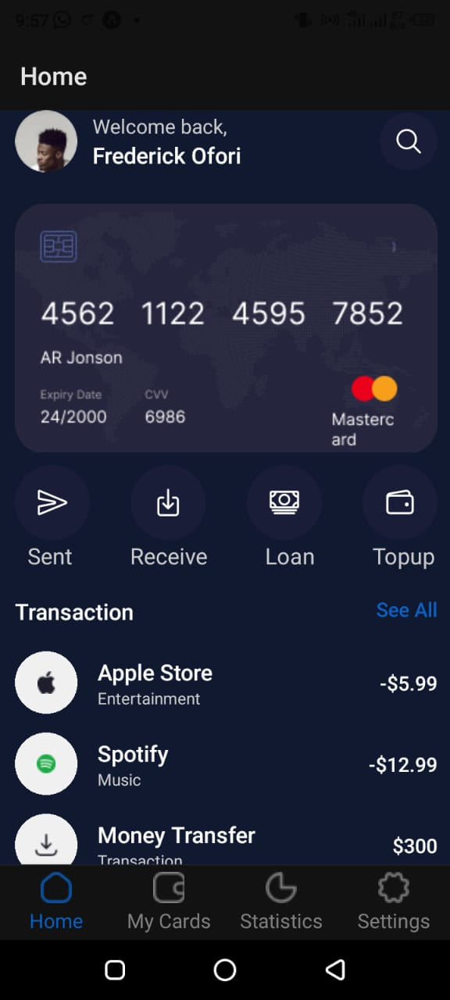
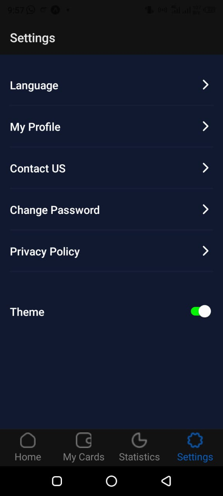

# rn-assignment5-11121058

## Overview

This is a simple finance tracker app built using React Native. It features a bottom tab navigator with four screens: Home, My Cards, Statistics, and Settings. The app supports both light and dark themes, which can be toggled from the settings screen. The home screen displays a user profile, card information, action icons, and a list of recent transactions.

## Features

- Bottom tab navigation
- Light and dark theme support
- Home screen with user profile, card information, action icons, and transactions list
- Settings screen with options and theme toggle switch
- Placeholder screens for My Cards and Statistics

## Technologies Used

- React Native
- React Navigation
- React Native Vector Icons

## Screenshots

### Light Theme




### Dark Theme




## How to Run the App

1. Clone the repository:
    ```bash
    git clone https://github.com/Bryan-Fred/rn-assignment5-11121058.git
    ```

2. Navigate to the project directory:
    ```bash
    cd rn-assignment5-11121058
    ```

3. Install the dependencies:
    ```bash
    npm install
    ```

4. Run the app:
    ```bash
    npx react-native run-android  # For Android
    npx react-native run-ios      # For iOS
    ```


## How I Built the Application

The application was built using React Native, leveraging the React Navigation library for tab navigation and React Native Vector Icons for the iconography. Context API is used to manage the light and dark theme settings, allowing for a seamless user experience across different themes.

1. **Navigation**: Set up a bottom tab navigator using `@react-navigation/bottom-tabs`.
2. **Theming**: Implemented a ThemeContext to manage light and dark themes.
3. **Screens**: Created screens for Home, My Cards, Statistics, and Settings.
4. **Styling**: Applied conditional styling based on the current theme using React Native's `StyleSheet`.
5. **Icons**: Used React Native Vector Icons to replace image-based icons for better theme adaptability.

## Contact

For any questions or feedback, feel free to reach out to me at fredofori306@gmail.com.
